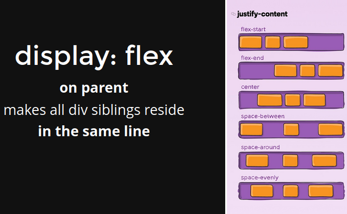

# BASICS OF HTML CSS JAVASCRIPT

> Code - https://replit.com/@adi_repl/00BASICSHTMLCSSJS#zerodhaLanding.html

## HTML
- Defines the elements to be displayed and their basic structure in the page
- Components:
  - Tags:
    ```html
    <html>
    <head>
    <title>
    <body>
    <div>/<span>
    <h1..h6>
    <p>
    
    <a>
    <input>
    <button>
    <b>, <i>
    <center> 
    ```

  - Attributes:
    ```html
    
    <a href="test.com">
    <button onclick="dosomething">
    <input id="password" placeholder="Password" type="password ">
    ```

## CSS
- Styles and Positions the html page
  ```html
  color
  backgroud
  border-radius
  border
  padding(adds the space inside the element)/ margin(add space outside the element)
  box-shadow 
  ```

  